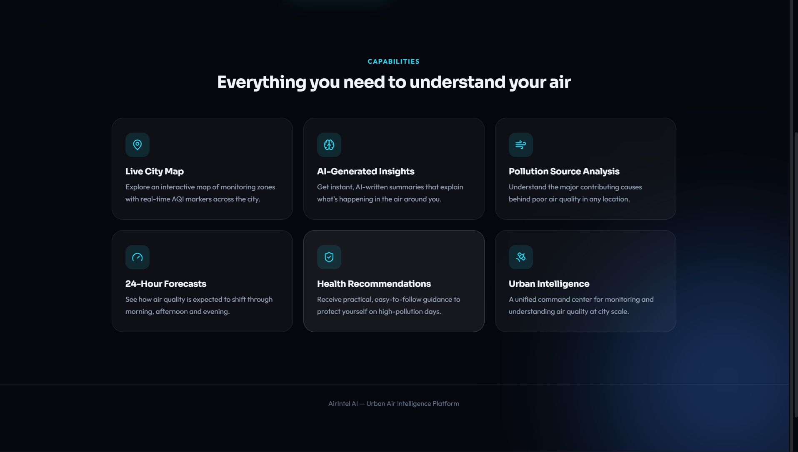
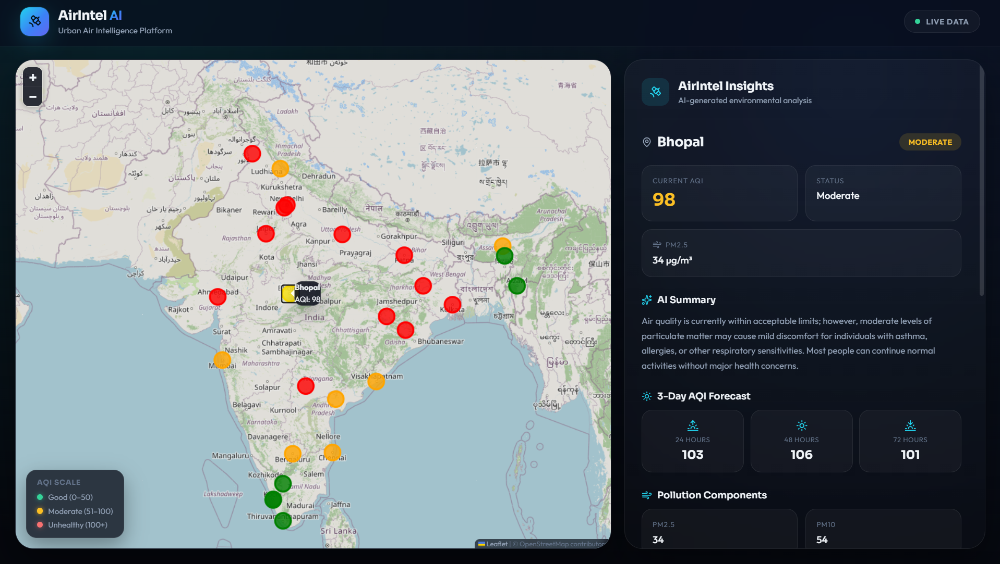

# 🌍 AirIntel AI

> **AI-powered Urban Air Intelligence Platform**

AirIntel AI is an intelligent environmental monitoring platform that helps users understand air quality through interactive maps, AI-generated insights, pollution analysis, and personalized health recommendations.

Developed for the **ET AI Hackathon 2026**.

---

# ✨ Problem Statement

Air pollution information is often difficult to understand for everyday users. Existing platforms primarily display AQI numbers without explaining their real-world health impact.

AirIntel transforms complex environmental data into clear, AI-powered insights that help citizens make informed decisions about their daily activities.

---

# 💡 Our Solution

AirIntel combines environmental data with Artificial Intelligence to provide:

- 🗺️ Interactive India AQI Map
- 🤖 AI-generated Environmental Insights
- ❤️ Personalized Health Recommendations
- 📊 Pollution Component Analysis
- 🌤️ AQI Forecast Visualization
- 🎯 Outdoor Activity Suggestions
- 😷 Smart Mask Recommendations

---

# 🚀 Key Features

### 🌍 Interactive AQI Map
Visualize pollution levels across major Indian cities using an intuitive color-coded map.

### 🤖 AI Environmental Analysis
Generate easy-to-understand summaries explaining current air quality conditions.

### ❤️ Health Recommendations
Receive personalized guidance based on pollution severity.

### 🌤️ AQI Forecast
Predict upcoming air quality trends to support informed planning.

### 📈 Pollution Breakdown
Analyze PM2.5, PM10, NO₂, SO₂, CO, and O₃ levels in one dashboard.

---

# 🛠️ Technology Stack

### Frontend
- React
- Vite
- Leaflet
- Axios

### Backend
- FastAPI
- Python

### AI
- Google Gemini
- OpenWeather API
- Machine Learning Ready Architecture

---

# 📊 Dashboard Preview

---

# 🎯 Future Scope

- Real-time AQI synchronization
- ML-based AQI forecasting
- Health risk prediction
- Push notifications
- Mobile application
- Historical trend analytics
- Smart city integration

---

# 👥 Team QUADCORE

**ET AI Hackathon 2026**

- JAYANI K
- SRIRANJANI M
- MADHUMITHA R R
- SARANYA V

---

# ❤️ Built for ET AI Hackathon 2026